# Railway Ticket Risk System

## 项目简介

铁路客运票务与风控运营管理系统是一个围绕铁路客运售票、订单支付、库存一致性、风险识别、风险处置和运营统计构建的后台管理系统。系统模拟铁路客运业务中的车次查询、余票锁定、订单支付、超时关闭、退票、风控事件生成、人工处置、权限控制和日志审计等核心流程。

当前版本采用 Spring Boot + Spring Data JPA 实现后端业务链路，使用 H2 作为本地演示数据库，并提供 MySQL profile。前端为原生 HTML/CSS/JavaScript 管理台，用于演示运营看板、订单管理、支付流水、风险事件和审计日志。

## 核心功能

- 车次余票查询：按出发站、到达站和乘车日期查询车次、票价和余票。
- 订单状态机：订单创建后进入 `PENDING_PAYMENT`，支持支付、关闭、超时关闭和退票。
- 库存一致性：创建待支付订单锁定库存，关闭和退票释放库存。
- 防超卖控制：座位库存使用 JPA 乐观锁版本号，降低并发扣减时的超卖风险。
- 下单幂等：下单接口支持 `requestId`，同一用户重复请求不会重复扣库存。
- 支付流水：支持创建模拟支付流水，记录支付号、支付渠道、支付状态和回调信息。
- 回调幂等：支付回调使用 `callbackRequestId`，重复回调不会重复改订单或重复触发风控。
- 风控规则引擎：使用 `RiskRule` 和 `RiskScene` 按场景调度风险规则。
- 风险处置闭环：风险事件支持待处理、确认风险、误报和关闭归档，并记录处置历史。
- 订单运营查询：订单列表支持按用户、状态、订单号、创建日期分页筛选。
- 风险运营报表：风险事件支持分页筛选，并统计状态分布、场景分布、误报率和处置完成率。
- 查询缓存：车次余票查询支持 local / Redis 缓存模式，库存相关交易动作提交后失效缓存。
- 接口限流：车次查询、下单、支付回调、风险处置等高频接口支持本地 / Redis 限流。
- 权限和审计：使用 Spring Security、JWT、BCrypt、角色校验、操作日志和风险处置历史。
- 集成测试：覆盖交易状态、幂等、并发防超卖、支付回调、风险处置、缓存和权限链路。

## 技术栈

- 后端：Java 8, Spring Boot 2.7, Spring Web, Spring Data JPA, Bean Validation
- 数据库：H2, MySQL profile
- 缓存：本地 TTL 缓存，Redis 可选模式
- 权限：Spring Security, JWT Bearer Token, BCrypt, `@RequiredRole`
- 测试：JUnit, Spring Boot Test
- 前端：HTML, CSS, JavaScript
- 工程化：Maven, Docker Compose, GitHub Actions

## 系统架构与流程

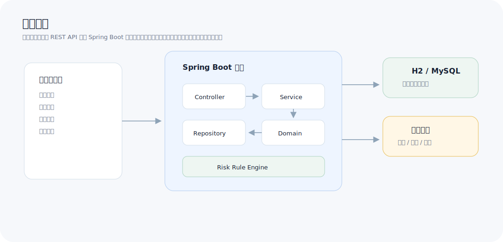

### 购票交易流程

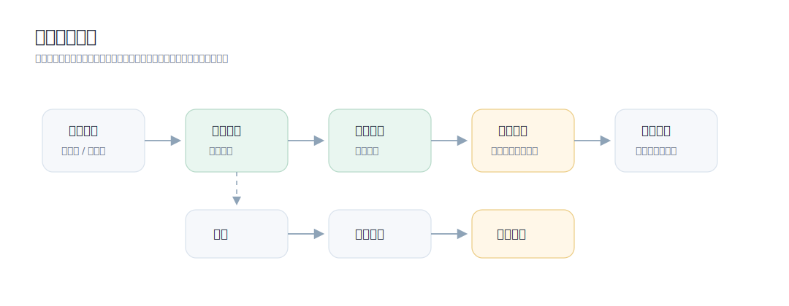

### 订单状态流转

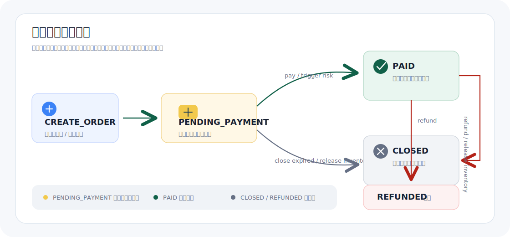

### 幂等提交流程

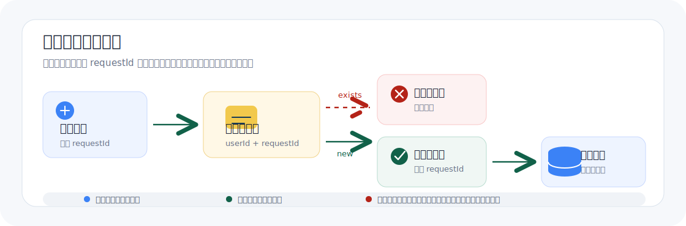

### 并发购票防超卖

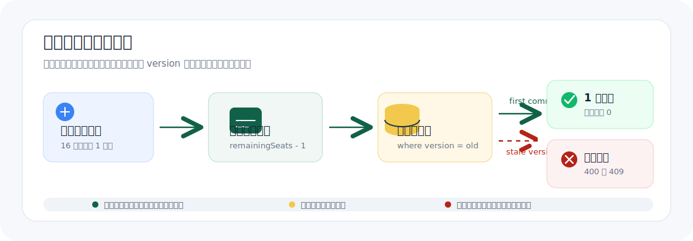

### 车次查询缓存

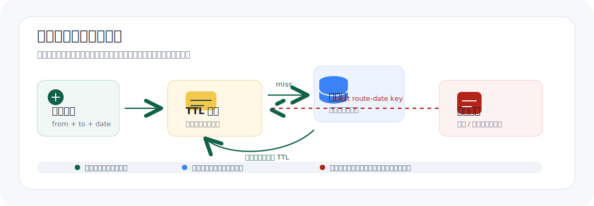

### 权限控制流程

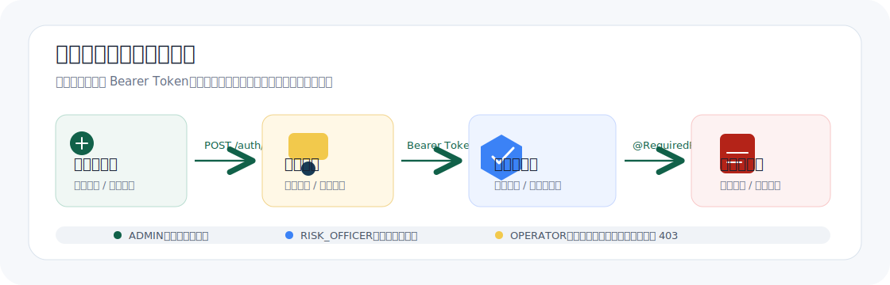

### 风控规则引擎

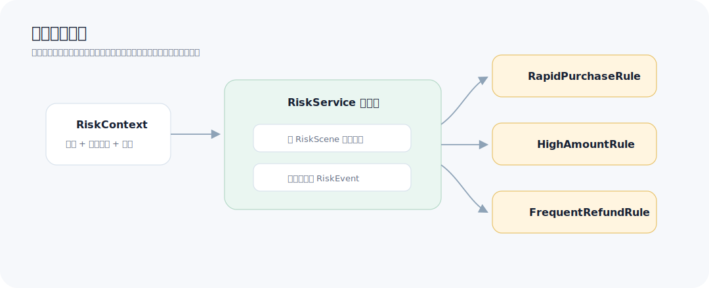

## 界面截图

### 运营看板与车次查询

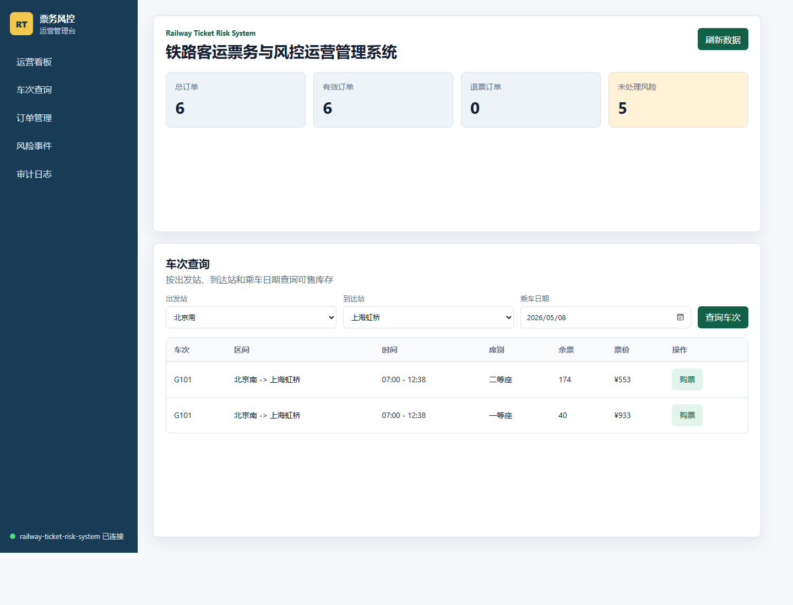

### 订单管理

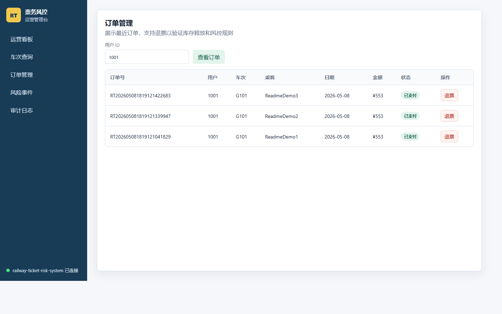

### 风险事件处理

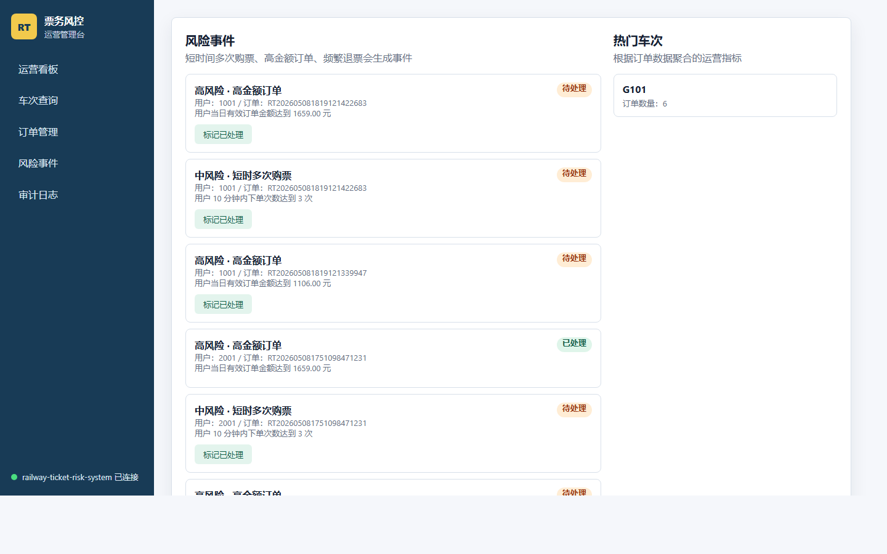

## 功能模块说明

| 模块 | 说明 |
| --- | --- |
| 车站车次 | 维护车站、车次和座位库存基础数据 |
| 车次查询 | 按线路和日期查询余票，支持 local / Redis TTL 缓存 |
| 订单管理 | 创建待支付订单、支付确认、关闭、超时关闭、退票和分页筛选 |
| 库存控制 | 通过事务和 JPA 乐观锁维护库存扣减与释放 |
| 支付流水 | 创建模拟支付流水，处理成功和失败回调 |
| 风险识别 | 支付成功和退票后触发风险规则 |
| 风险处置 | 支持风险状态流转、处置备注、处理人和处置历史 |
| 运营看板 | 展示订单状态、退票率、风险率、未处理风险和热门车次 |
| 权限审计 | 登录鉴权、角色校验、操作日志和审计追踪 |

## 主要接口

```text
GET  /api/health
POST /api/auth/login
GET  /api/auth/me
GET  /api/stations
GET  /api/trains/search?from=BJP&to=SHH&date=2026-06-01
POST /api/orders
POST /api/orders/{id}/pay
POST /api/orders/{id}/close
POST /api/orders/close-expired
POST /api/orders/{id}/refund
GET  /api/orders?userId=1001&status=PAID&page=0&size=10
POST /api/payments
POST /api/payments/callback
GET  /api/payments?status=SUCCESS&page=0&size=10
GET  /api/risks?status=PENDING&scene=ORDER_CREATED&page=0&size=10
GET  /api/risks/summary
POST /api/risks/{id}/handle
GET  /api/risks/{id}/handle-records
GET  /api/cache/train-search
DELETE /api/cache/train-search
GET  /api/rate-limit/summary
GET  /api/dashboard/summary
GET  /api/logs
```

完整说明见 [API 设计](docs/api-design.md)。

## 数据库核心表

| 表 | 说明 |
| --- | --- |
| `app_users` | 演示用户、角色和启用状态 |
| `stations` | 车站基础数据 |
| `trains` | 车次基础数据 |
| `seat_inventories` | 车次日期库存、座位类型、余票、票价和乐观锁版本 |
| `ticket_orders` | 订单号、乘客、金额、状态和支付/退票/关闭时间 |
| `payment_records` | 支付流水号、支付状态、渠道、回调请求号和支付时间 |
| `risk_events` | 风险类型、等级、场景、状态和最新处置信息 |
| `risk_event_handle_records` | 风险事件处置前后状态、备注、操作人和操作时间 |
| `operation_logs` | 关键业务动作审计日志 |

数据库字段见 [数据库设计](docs/database-design.md)，实体关系见 [ER 图](docs/er-diagram.mmd)。

## 目录结构

```text
railway-ticket-risk-system
├── backend              # Spring Boot 后端
├── frontend             # 原生前端管理台
├── docs                 # 设计文档、ER 图、流程图和截图
├── scripts              # 辅助验证脚本
├── docker-compose.yml   # MySQL + 后端编排
└── README.md
```

## 快速启动

### 后端启动

```bash
cd backend
mvn spring-boot:run
```

启动后访问：

- API 健康检查：`http://localhost:8080/api/health`
- H2 控制台：`http://localhost:8080/h2-console`

H2 JDBC URL：

```text
jdbc:h2:mem:railway
```

使用 MySQL profile：

```bash
cd backend
mvn spring-boot:run -Dspring-boot.run.profiles=mysql
```

### 前端启动

```bash
cd frontend
node static-server.js
```

访问：

```text
http://127.0.0.1:5173
```

## 演示账号

| 账号 | 密码 | 角色 | 可操作范围 |
| --- | --- | --- | --- |
| `admin` | `admin123` | 系统管理员 | 查看日志、处理风险事件、管理缓存 |
| `risk` | `risk123` | 风控专员 | 查看日志、处理风险事件 |
| `ops` | `ops123` | 运营人员 | 查看运营数据，不能处理风险事件 |

## 测试方式

```bash
cd backend
mvn test
```

前端脚本语法检查：

```bash
node --check frontend\app.js
```

并发购票验证脚本：

```bash
node scripts/concurrent-purchase.js 30
```

可选环境变量：

```text
API_BASE=http://localhost:8080/api
REQUESTS=50
FROM=BJP
TO=SHH
DATE=2026-06-01
TRAIN_ID=1
INVENTORY_ID=1
```

## 已验证链路

- 创建待支付订单后余票锁定。
- 支付成功后订单进入 `PAID`，并触发支付后风控规则。
- 支付流水创建后为 `PENDING`，成功回调后变为 `SUCCESS`。
- 相同 `callbackRequestId` 重复回调不会重复触发风控。
- 支付失败回调后流水变为 `FAILED`，订单保持待支付。
- 待支付订单可手动关闭或超时批量关闭，关闭后释放库存。
- 已支付订单可退票，退票后释放库存并触发退票后风控规则。
- 风险事件可确认为风险、标记误报或关闭归档，处置历史和操作日志均可追踪。
- 订单、支付流水、风险事件均支持分页筛选。
- 车次查询可命中缓存，库存相关交易动作提交后失效缓存。
- 高频接口超过限流阈值时返回 429，避免单一用户或来源持续占用接口资源。
- 未登录访问受保护接口返回 401，权限不足返回 403。
- 登录成功后签发 JWT，前端通过 `Authorization: Bearer {token}` 访问受保护接口。
- 并发请求抢同一张票时，只能成功创建符合库存数量的订单。

## 核心设计说明

### 订单状态机

订单创建后先进入 `PENDING_PAYMENT` 并锁定库存。支付成功后进入 `PAID`，待支付订单可以关闭为 `CLOSED`，已支付订单可以退票为 `REFUNDED`。系统只允许以下流转：

```text
PENDING_PAYMENT -> PAID
PENDING_PAYMENT -> CLOSED
PAID -> REFUNDED
```

### 库存一致性

创建待支付订单时扣减库存，关闭和退票时释放库存。库存表使用 JPA 乐观锁版本号处理并发扣减冲突，避免多个请求同时扣减同一份库存时产生超卖。

### 幂等处理

下单接口使用 `userId + requestId` 保证重复提交不重复扣库存。支付流水创建使用 `requestId` 避免重复生成待支付流水。支付回调使用 `callbackRequestId` 防止重复回调造成重复订单状态变更、重复风控和重复日志。

### 风控处置闭环

系统通过规则引擎生成风险事件。风险事件创建后进入 `PENDING`，风控人员可以将其处置为 `CONFIRMED`、`FALSE_POSITIVE` 或 `CLOSED`。每次处置都会记录当前状态、前后状态、备注、操作人和操作时间。

### 查询缓存

车次余票查询按出发站、到达站和乘车日期构建缓存 Key。默认使用本地 TTL 缓存，也可切换为 Redis 缓存；锁票、支付、关闭和退票动作提交后失效对应线路日期缓存，避免余票展示长期不一致。Redis 不可用时，默认演示环境仍使用本地缓存。

### 接口限流

系统对车次查询、下单、支付回调和风险处置进行固定窗口限流。已登录请求优先使用用户维度，匿名查询使用 IP 维度，支付回调使用支付流水号和 IP 组合。超过阈值时统一返回 429 和 `TOO_MANY_REQUESTS` 错误码。

### 认证授权

系统使用 Spring Security 以无状态方式接入认证链路。登录接口校验 BCrypt 密码后签发 HMAC-SHA256 JWT，JWT 中包含用户 ID、用户名、角色、签发时间和过期时间。后端过滤器解析 Bearer Token 并写入 SecurityContext，敏感接口继续通过 `@RequiredRole` 校验 `ADMIN`、`RISK_OFFICER`、`OPERATOR` 的访问范围。

## 文档目录

- [项目大纲](docs/project-outline.md)
- [API 设计](docs/api-design.md)
- [数据库设计](docs/database-design.md)
- [ER 图](docs/er-diagram.mmd)
- [安全认证设计](docs/security-design.md)
- [订单状态机设计](docs/order-state-design.md)
- [缓存与限流设计](docs/cache-and-rate-limit-design.md)
- [支付流水设计](docs/payment-design.md)
- [风险处置闭环设计](docs/risk-handling-design.md)
- [订单幂等设计](docs/idempotency-design.md)
- [缓存设计](docs/cache-design.md)
- [并发防超卖设计](docs/concurrency-design.md)
- [技术设计笔记](docs/technical-design-notes.md)
- [项目最终总结](docs/final-project-summary.md)
- [开发日志](docs/project-development-log.md)
- [GitHub 上传步骤](docs/github-upload.md)

## 后续规划

- 完善 Redis 部署示例和缓存监控指标。
- 使用延时队列优化超时订单关闭。
- 增加支付回调签名校验。
- 增加 refresh token、登录失败限制和令牌失效机制。
- 增加风险等级、处理人、处理 SLA 和导出报表。
- 增加接口压测、异常场景测试和端到端验证。
